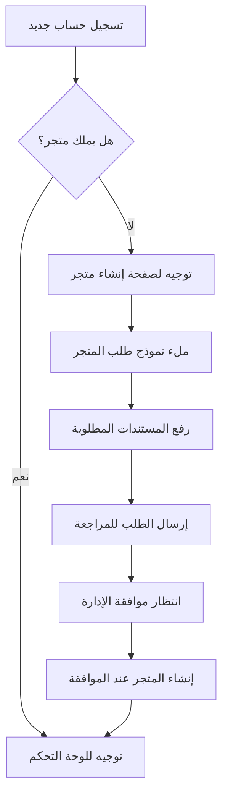

# 📚 دليل إدارة المتاجر الشامل - Best on Click

## 🎯 نظرة عامة على نظام إدارة المتاجر

### 📋 **ما هو نظام إدارة المتاجر؟**

نظام إدارة المتاجر في Best on Click هو منصة متكاملة تسمح للتجار بـ:
- **إنشاء متاجر إلكترونية** داخل المنصة
- **إدارة المنتجات والمبيعات**
- **تتبع الأداء والتحليلات**
- **التفاعل مع العملاء**
- **مراقبة الإحصائيات والتقارير**

---

## 🏗️ بنية النظام والنماذج

### 1. **📊 Store Management Models**

#### **أ) Product Analytics (تحليلات المنتجات)**
```
📈 الغرض: تتبع أداء كل منتج بشكل مفصل
📊 البيانات المتتبعة:
   - إجمالي المشاهدات والمشاهدات الفريدة
   - التفاعلات (إعجابات، تعليقات، مشاركات)
   - معدلات التحويل (إضافة للسلة، شراء)
   - اتجاهات الأداء عبر الزمن
```

**🤔 هل هذا ضروري؟**
- ✅ **نعم، ضروري جداً** لأصحاب المتاجر لفهم:
  - أي المنتجات تحقق أفضل أداء
  - متى يحتاجون لتحسين منتج معين
  - كيفية تحسين استراتيجيات التسويق
- ❌ **ليس من وظيفة الذكاء الاصطناعي** - هذه بيانات إحصائية أساسية
- 🎯 **الذكاء الاصطناعي يستخدم هذه البيانات** لتقديم توصيات، لكن جمع البيانات أساسي

#### **ب) Store Analytics (تحليلات المتجر)**
```
📈 الغرض: نظرة شاملة على أداء المتجر
📊 البيانات المتتبعة:
   - إجمالي الزوار والمبيعات
   - أفضل المنتجات أداءً
   - معدلات التحويل العامة
   - نمو المتجر عبر الزمن
```

#### **ج) Store Applications (طلبات إنشاء المتاجر)**
```
📝 الغرض: إدارة طلبات التجار لإنشاء متاجر جديدة
🔄 العملية:
   1. التاجر يقدم طلب إنشاء متجر
   2. الإدارة تراجع الطلب والمستندات
   3. الموافقة أو الرفض مع الأسباب
   4. إنشاء المتجر عند الموافقة
```

#### **د) Store Feedbacks (آراء العملاء)**
```
💬 الغرض: إدارة مراجعات وتقييمات العملاء
📊 الميزات:
   - تقييمات متعددة المستويات
   - ردود أصحاب المتاجر
   - تصفية وترتيب المراجعات
   - تحليل المشاعر
```

#### **هـ) Store Notifications (إشعارات المتجر)**
```
🔔 الغرض: نظام إشعارات ذكي لأصحاب المتاجر
📱 أنواع الإشعارات:
   - إشعارات الطلبات الجديدة
   - تنبيهات انخفاض المخزون
   - مراجعات جديدة من العملاء
   - تحديثات الأداء
```

#### **و) Store View Logs (سجلات مشاهدة المتجر)**
```
👁️ الغرض: تتبع زيارات المتجر بالتفصيل
📊 البيانات:
   - تاريخ ووقت الزيارة
   - مصدر الزائر
   - الصفحات المزارة
   - مدة البقاء
```

---

## 🚀 رحلة المستخدم: من التسجيل إلى إدارة المتجر

### **المرحلة 1: تسجيل مالك متجر جديد**



### **المرحلة 2: نموذج طلب إنشاء المتجر**

#### **📝 معلومات الطلب (Application Info)**
```javascript
{
  applicant: "معرف مقدم الطلب",
  status: "pending|approved|rejected", 
  reviewed_by: "معرف المراجع",
  review_notes: "ملاحظات المراجعة"
}
```

#### **🏪 تفاصيل المتجر (Store Details)**
```javascript
{
  store_name: "اسم المتجر",
  store_description: "وصف المتجر ونشاطه",
  business_type: "نوع النشاط التجاري",
  category: "الفئة (إلكترونيات، ملابس، إلخ)"
}
```

#### **📞 معلومات الاتصال (Contact Information)**
```javascript
{
  business_email: "البريد الإلكتروني التجاري",
  business_phone: "رقم الهاتف التجاري", 
  business_address: "عنوان المتجر الفعلي"
}
```

#### **⚖️ المعلومات القانونية (Legal Information)**
```javascript
{
  business_license: "رقم السجل التجاري",
  tax_id: "الرقم الضريبي",
  legal_structure: "الشكل القانوني للمنشأة"
}
```

#### **📄 المستندات المطلوبة (Documents)**
```javascript
{
  business_license_document: "ملف السجل التجاري",
  identity_document: "ملف الهوية الشخصية",
  tax_certificate: "ملف الشهادة الضريبية (اختياري)"
}
```

---

## 🔧 التكامل مع الواجهة الأمامية (Frontend Integration)

### **1. فحص حالة المستخدم عند تسجيل الدخول**

```javascript
// في authService
async function checkUserStoreStatus(userId) {
  try {
    const response = await apiService.stores.getUserStores(userId);
    return {
      hasStore: response.stores && response.stores.length > 0,
      stores: response.stores || [],
      needsStoreCreation: !response.stores || response.stores.length === 0
    };
  } catch (error) {
    console.error('Error checking store status:', error);
    return { hasStore: false, needsStoreCreation: true };
  }
}
```

### **2. توجيه المستخدم حسب حالته**

```javascript
// في router.js
async function handleStoreOwnerLogin(user) {
  const storeStatus = await checkUserStoreStatus(user.id);
  
  if (storeStatus.needsStoreCreation) {
    // توجيه لصفحة إنشاء متجر
    router.navigate('/store/apply');
    showInfo('مرحباً! يرجى إنشاء متجرك أولاً للبدء في البيع');
  } else {
    // توجيه للوحة التحكم
    router.navigate('/store/dashboard');
    showSuccess(`مرحباً بعودتك إلى متجر ${storeStatus.stores[0].name}`);
  }
}
```

### **3. نموذج إنشاء المتجر**

```javascript
// في store-application.js
const storeApplicationForm = {
  // معلومات أساسية
  storeName: '',
  storeDescription: '',
  businessType: '',
  
  // معلومات الاتصال
  businessEmail: '',
  businessPhone: '',
  businessAddress: '',
  
  // معلومات قانونية
  businessLicense: '',
  taxId: '',
  
  // المستندات
  businessLicenseFile: null,
  identityFile: null,
  
  // التحقق من صحة البيانات
  validate() {
    const errors = {};
    
    if (!this.storeName.trim()) {
      errors.storeName = 'اسم المتجر مطلوب';
    }
    
    if (!this.businessEmail.trim()) {
      errors.businessEmail = 'البريد الإلكتروني مطلوب';
    }
    
    if (!this.businessLicense.trim()) {
      errors.businessLicense = 'رقم السجل التجاري مطلوب';
    }
    
    if (!this.businessLicenseFile) {
      errors.businessLicenseFile = 'ملف السجل التجاري مطلوب';
    }
    
    if (!this.identityFile) {
      errors.identityFile = 'ملف الهوية مطلوب';
    }
    
    return {
      isValid: Object.keys(errors).length === 0,
      errors
    };
  }
};
```

---

## 🔗 ربط Backend مع Frontend

### **1. API Endpoints المطلوبة**

```python
# في Django Backend
class StoreApplicationViewSet(viewsets.ModelViewSet):
    """
    API لإدارة طلبات إنشاء المتاجر
    """
    
    def create(self, request):
        """إنشاء طلب متجر جديد"""
        pass
    
    def list(self, request):
        """قائمة طلبات المستخدم"""
        pass
    
    def retrieve(self, request, pk=None):
        """تفاصيل طلب محدد"""
        pass
    
    def update(self, request, pk=None):
        """تحديث حالة الطلب (للإدارة)"""
        pass

class UserStoreViewSet(viewsets.ModelViewSet):
    """
    API لإدارة متاجر المستخدم
    """
    
    def get_user_stores(self, request):
        """الحصول على متاجر المستخدم"""
        pass
    
    def create_store(self, request):
        """إنشاء متجر جديد بعد الموافقة"""
        pass
```

### **2. نماذج البيانات المطلوبة**

```python
# models.py
class StoreApplication(models.Model):
    """نموذج طلب إنشاء متجر"""
    
    # معلومات الطلب
    applicant = models.ForeignKey(User, on_delete=models.CASCADE)
    status = models.CharField(max_length=20, choices=[
        ('pending', 'قيد المراجعة'),
        ('approved', 'موافق عليه'),
        ('rejected', 'مرفوض'),
    ], default='pending')
    reviewed_by = models.ForeignKey(User, null=True, blank=True, 
                                   related_name='reviewed_applications',
                                   on_delete=models.SET_NULL)
    review_notes = models.TextField(blank=True)
    
    # تفاصيل المتجر
    store_name = models.CharField(max_length=200)
    store_description = models.TextField()
    business_type = models.CharField(max_length=100)
    
    # معلومات الاتصال
    business_email = models.EmailField()
    business_phone = models.CharField(max_length=20)
    business_address = models.TextField()
    
    # معلومات قانونية
    business_license = models.CharField(max_length=100)
    tax_id = models.CharField(max_length=50)
    
    # المستندات
    business_license_document = models.FileField(upload_to='store_documents/')
    identity_document = models.FileField(upload_to='store_documents/')
    
    # التواريخ
    created_at = models.DateTimeField(auto_now_add=True)
    updated_at = models.DateTimeField(auto_now=True)
    reviewed_at = models.DateTimeField(null=True, blank=True)

class Store(models.Model):
    """نموذج المتجر"""
    
    owner = models.ForeignKey(User, on_delete=models.CASCADE)
    name = models.CharField(max_length=200)
    description = models.TextField()
    business_type = models.CharField(max_length=100)
    
    # معلومات الاتصال
    email = models.EmailField()
    phone = models.CharField(max_length=20)
    address = models.TextField()
    
    # معلومات قانونية
    business_license = models.CharField(max_length=100)
    tax_id = models.CharField(max_length=50)
    
    # حالة المتجر
    is_active = models.BooleanField(default=True)
    is_verified = models.BooleanField(default=False)
    
    # إحصائيات
    total_products = models.IntegerField(default=0)
    total_sales = models.DecimalField(max_digits=10, decimal_places=2, default=0)
    rating = models.FloatField(default=0)
    
    # التواريخ
    created_at = models.DateTimeField(auto_now_add=True)
    updated_at = models.DateTimeField(auto_now=True)
```

---

## 🛠️ سكريبت إنشاء تطبيق المتجر

### **إنشاء Django App للمتاجر**

```bash
# في مجلد Backend
python manage.py startapp store_management

# إضافة التطبيق في settings.py
INSTALLED_APPS = [
    # ... التطبيقات الأخرى
    'store_management',
]

# إنشاء وتطبيق الـ migrations
python manage.py makemigrations store_management
python manage.py migrate
```

### **إعداد URLs**

```python
# store_management/urls.py
from django.urls import path, include
from rest_framework.routers import DefaultRouter
from . import views

router = DefaultRouter()
router.register(r'applications', views.StoreApplicationViewSet)
router.register(r'stores', views.StoreViewSet)

urlpatterns = [
    path('api/store-management/', include(router.urls)),
    path('api/store-management/user-stores/', views.get_user_stores, name='user-stores'),
]

# في urls.py الرئيسي
urlpatterns = [
    # ... URLs أخرى
    path('', include('store_management.urls')),
]
```

---

## 🎯 خطة التنفيذ المرحلية

### **المرحلة 1: إعداد Backend (أولوية عالية)**
1. ✅ إنشاء Django app للمتاجر
2. ✅ إنشاء النماذج المطلوبة
3. ✅ إعداد API endpoints
4. ✅ اختبار APIs

### **المرحلة 2: تحسين Frontend (أولوية عالية)**
1. ✅ إصلاح صفحة التحليلات
2. ✅ إصلاح صفحة آراء العملاء  
3. ✅ إضافة فحص حالة المتجر عند تسجيل الدخول
4. ✅ تحسين نموذج إنشاء المتجر

### **المرحلة 3: التكامل والاختبار (أولوية متوسطة)**
1. ✅ ربط Frontend مع Backend
2. ✅ اختبار رحلة المستخدم الكاملة
3. ✅ إضافة معالجة الأخطاء
4. ✅ تحسين تجربة المستخدم

---

## 🤔 الإجابة على أسئلتك المحددة

### **1. هل تم ربط التطبيق مع Frontend؟**
- ❌ **حالياً:** الربط جزئي - الواجهة موجودة لكن تحتاج تحسين الاتصال مع Backend
- ✅ **المطلوب:** إنشاء APIs كاملة وربطها بالواجهة

### **2. هل نحتاج إنشاء Django app للمتاجر؟**
- ✅ **نعم، ضروري جداً** لـ:
  - تنظيم الكود بشكل أفضل
  - إدارة نماذج البيانات
  - توفير APIs متخصصة
  - سهولة الصيانة والتطوير

### **3. هل تحليلات المنتجات ضرورية؟**
- ✅ **نعم، ضرورية** لأنها:
  - تساعد التجار في اتخاذ قرارات مدروسة
  - توفر بيانات للذكاء الاصطناعي لتحسين التوصيات
  - تحسن تجربة المستخدم العامة
  - تزيد من قيمة المنصة للتجار

### **4. المشاكل الحالية:**
- ❌ صفحة التحليلات لا تعمل
- ❌ صفحة آراء العملاء لا تعمل  
- ❌ لا يوجد فحص لحالة المتجر عند تسجيل الدخول
- ❌ نقص في ربط Backend

---

## 🚀 الخطوات التالية

1. **إنشاء سكريبت Django app للمتاجر**
2. **إصلاح صفحات Dashboard المعطلة**
3. **إضافة فحص حالة المتجر**
4. **تحسين نموذج إنشاء المتجر**
5. **اختبار التكامل الكامل**

هل تريد أن أبدأ بتنفيذ هذه الخطوات؟